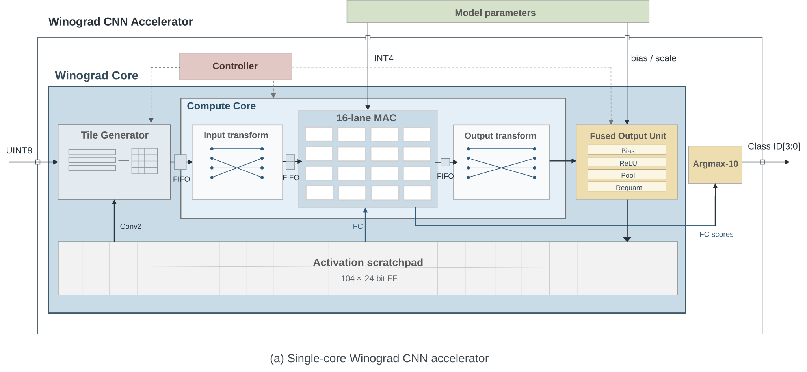

# Winograd CNN Accelerator 설계 개발 기록

## 1. 프로젝트 개요

본 프로젝트의 목표는 대회에서 제공한 MNIST CNN의 정확도를 유지하면서 연산량,
중간 데이터 저장량 및 데이터 이동을 줄인 합성 가능한 CNN 가속기를 설계하는
것이다. 기존 5×5 convolution 기반 모델을 3×3 convolution 기반 모델로 변경하고,
두 convolution layer에 Winograd F(2×2, 3×3) 알고리즘을 적용하였다. 학습 단계에서는
하드웨어의 W4A8 수치 형식을 반영한 quantization-aware training(QAT)을 수행하였다.

최종 설계는 하나의 Winograd compute core를 convolution과 fully-connected(FC)
연산에 시간 다중화하여 사용한다. Tile 단위로 생성된 convolution 결과는 bias,
ReLU, pooling 및 requantization을 거쳐 다음 계층의 activation storage에 직접
기록된다. 이를 통해 각 연산 사이에 전체 feature map을 반복 저장하는 구조를
피하고, 제한된 연산 자원과 저장 공간을 재사용한다.



## 2. 최종 설계 사양

| 항목 | 최종 사양 |
|---|---|
| CNN 구조 | Conv1 3×3 → ReLU/Pool → Conv2 3×3 → ReLU/Pool → FC → Argmax |
| Winograd 알고리즘 | F(2×2, 3×3), 4×4 input tile에서 2×2 output tile 생성 |
| 연산 구조 | 16-lane Winograd-domain MAC array, convolution/FC 공유 |
| Weight | Signed INT4 |
| Activation | Unsigned INT8 |
| Input transform 결과 V | Signed INT11 |
| Compute 및 accumulator | Signed INT18 |
| Bias 저장 | Signed INT16 |
| 중간 activation storage | 104 × 24-bit FF scratchpad |
| Pipeline buffer depth | Conv1 tile FIFO 2, V replay 2, M FIFO 1 |
| 목표 동작 주파수 | 1 GHz |
| 검증 정확도 | 1,000장 중 970장 정답, 97.0% |

## 3. 설계 과정

### 3.1 알고리즘 및 수치 형식 결정

대회 baseline의 전체 계층 구성과 채널 수는 유지하고 convolution kernel을 5×5에서
3×3으로 변경하였다. 변경된 모델은 FP32 spatial convolution으로 먼저 학습한 뒤,
동일한 spatial master weight를 Winograd domain으로 변환하여 학습하는 QAT 구조로
구현하였다.

Winograd convolution은 다음 네 단계로 구성된다.

```text
U = G g G^T
V = B^T d B
M = sum_c(U ⊙ V)
Y = A^T M A
```

F(2×2, 3×3)의 input/output transform 행렬은 0, 1, -1로 구성할 수 있으므로,
transform datapath는 multiplier 없이 adder와 subtractor만으로 구현하였다. Weight
transform 결과 U와 FC weight에는 signed INT4 fake quantization을 적용하고,
activation에는 unsigned INT8 fake quantization을 적용하였다. 최종 정수 모델은
대회 입력 1,000장에서 97.00%, MNIST test set 10,000장에서 96.25%의 정확도를
기록하였다.

중간 연산 폭은 bit-accurate integer inference로 결정하였다. 평가 데이터에서는
14-bit compute까지 saturation이 발생하지 않았지만, 입력 분포 변화에 대한 여유를
확보하기 위해 RTL의 product 및 accumulator 경로는 INT18로 유지하였다. 최종
INT18 구성에서는 10,000장 추론의 모든 관측 지점에서 saturation이 0회였다.

### 3.2 단일 Winograd compute core 구성

초기 구조는 activation 전체를 저장한 뒤 다중 포트 조합 MUX로 4×4 tile을 읽는
방식이었다. 이 구조는 임의 주소 접근은 쉽지만 FF bank의 read MUX가 면적과
critical path를 크게 증가시켰다. 최종 구조에서는 입력의 raster 순서를 이용한
sliding-window generator로 4×4 tile을 순차 생성한다.

생성된 tile은 다음 순서로 처리된다.

1. Input transform이 4×4 activation tile을 Winograd domain V로 변환한다.
2. 16-lane MAC array가 V와 transformed weight U의 element-wise product를 계산한다.
3. 입력 채널이 여러 개인 경우 동일 위치의 결과를 channel 방향으로 누산한다.
4. Output transform이 4×4 M tile을 2×2 spatial output tile로 복원한다.
5. Fused output unit이 bias, ReLU, pooling 및 requantization을 연속 처리한다.
6. 처리된 UINT8 activation을 다음 계층의 scratchpad에 기록한다.

동일한 MAC array는 FC 단계에서도 사용한다. FC mode에서는 75개 입력 feature를
시간 방향으로 누산하고, 최종 10개 class score를 pipelined argmax tree에 전달한다.
따라서 convolution과 FC를 위한 별도의 multiplier array를 두지 않는다.

세부 microarchitecture는 다음 도면에 정리하였다.

| 블록 | 설계도 |
|---|---|
| Tile generator | [winograd_tile_generator_microarchitecture.svg](docs/figures/winograd_tile_generator_microarchitecture.svg) |
| Input transform | [winograd_input_transform_microarchitecture.svg](docs/figures/winograd_input_transform_microarchitecture.svg) |
| MAC array | [winograd_mac_array_microarchitecture.svg](docs/figures/winograd_mac_array_microarchitecture.svg) |
| Output transform | [winograd_output_transform_microarchitecture.svg](docs/figures/winograd_output_transform_microarchitecture.svg) |
| Elastic FIFO | [elastic_fifo_microarchitecture.svg](docs/figures/elastic_fifo_microarchitecture.svg) |
| Fused output unit | [winograd_fused_output_unit_microarchitecture.svg](docs/figures/winograd_fused_output_unit_microarchitecture.svg) |

### 3.3 Pipeline buffer 깊이 결정

각 블록은 valid/ready handshake로 연결하였다. 외부 입력은 ready 신호를 확인하지
않고 784개 pixel을 연속 전송하므로, 내부 backpressure가 입력까지 전파되면 pixel이
유실된다. 이에 따라 1,000장 RTL sweep을 수행하여 기능을 보존하는 최소 buffer
깊이를 결정하였다.

| Conv1 tile FIFO | V replay | M FIFO | 결과 | 입력 backpressure | 정확도 |
|---:|---:|---:|---|---:|---:|
| 2 | 2 | 2 | PASS | 0 cycle | 97% |
| 2 | 2 | 1 | PASS, 최종 채택 | 0 cycle | 97% |
| 2 | 1 | 2 | FAIL | 36,000 cycle/1,000 images | 9% |

V replay buffer는 실제 최대 occupancy가 2이므로 depth 2가 필요하다. 반면 M FIFO는
최대 occupancy가 1이고 downstream backpressure가 발생하지 않아 depth 1로
축소하였다. 이 변경은 기능과 latency를 유지하면서 flip-flop 299개와 cell area
1.29%를 줄였다.

### 3.4 Activation lifetime 기반 저장 공간 최적화

Conv1과 Conv2 사이의 activation을 모두 보존하는 169-entry 구조에서 시작하여,
실제 데이터 lifetime과 소비 범위를 기준으로 storage를 단계적으로 축소하였다.

1. Conv2가 참조하지 않는 Conv1 결과의 마지막 행과 열을 저장 대상에서 제외하였다.
2. 첫 Conv2 window에 필요한 40개 vector를 window generator에 직접 선적재하였다.
3. 나머지 104개 vector만 sequential frame buffer에 저장하였다.
4. Conv2가 이미 읽은 주소 0~24를 Conv2 출력 및 FC 입력 저장 공간으로 재사용하였다.

각 주소에는 세 채널의 activation을 하나의 24-bit word로 묶었다. Conv2에서는
spatial position 단위로 접근하고, FC에서는 byte lane을 선택하여 channel-major
순서를 복원한다. 접근 주체가 실행 단계별로 고정되어 있으므로 범용 memory
arbitration은 필요하지 않다.

| 구조 | 중간 저장량 | Post-input latency | Cell area | Fmax |
|---|---:|---:|---:|---:|
| 169-entry 기준 | 4,656 bit | 484 cycle | 9,366.15 µm² | 1,092.26 MHz |
| 최종 104-entry reuse | 2,496 bit | 433 cycle | 7,880.81 µm² | 1,072.98 MHz |

최종 구조는 기준 대비 중간 저장량을 46.39%, cell area를 15.86%, post-input
latency를 10.54% 줄였다. 모든 단계에서 1,000장 RTL mismatch 0과 입력
backpressure 0을 확인한 후 다음 단계로 진행하였다.

### 3.5 Zero-skip 제어 경로 최적화

MAC lane은 weight가 0이거나 lane이 비활성인 경우 multiplier 입력을 0으로
고정하여 불필요한 switching을 억제하고 accumulator 값을 유지한다. 초기 구현은
누산 단계에서 zero-weight 조건을 다시 조합하여 accumulator 앞의 제어 경로가
critical path가 되었다.

최종 구현에서는 다음 조건을 multiplier pipeline stage에서 미리 계산하여
`pipe_accumulate` 레지스터에 저장한다.

```text
pipe_accumulate = lane_active && !weight_zero
```

Accumulator stage는 등록된 신호만으로 update 여부를 선택한다. 연산 결과와
pipeline latency는 유지하면서 Fmax는 1,056.86 MHz에서 1,180.21 MHz로 11.67%
향상되었고, cell area 증가는 0.18%에 그쳤다.

### 3.6 미채택 설계 검토

사용되지 않는 Conv1 경계 tile 25개를 core에 전달하지 않는 dead-tile pruning도
검토하였다. 이 방식은 core 실행 tile을 14.79% 줄이고 전체 latency를 약 2.05%
단축했으나, 추가 제어로 cell area가 0.73% 증가하고 Fmax가 2.55% 감소하였다.
전체 PPA 개선이 확인되지 않아 최종 RTL에서는 원복하였다. 해당 결과는 연산량
감소가 제어 비용을 포함한 하드웨어 효율 개선으로 항상 이어지지는 않는다는
설계 탐색 근거로 보존하였다.

## 4. 검증 방법

기능 검증은 블록 단위와 전체 시스템 단위로 나누어 수행하였다.

- Input/output transform: Python Winograd reference와 RTL 결과 비교
- MAC array: zero-weight, channel accumulation, FC mode 및 saturation 검증
- Elastic FIFO: full/empty, simultaneous push/pop, backpressure 시 데이터 유지 검증
- Fused output unit: bias, pooling, ReLU, requantization 및 UINT8 clamp 검증
- 전체 RTL: 대회 입력 1,000장에 대해 Python integer golden과 class decision 비교
- 합성 netlist: ASAP7 zero-delay functional model을 이용한 1,000장 gate regression
- Timing/area: 동일한 ASAP7 OpenROAD post-synthesis flow로 비교
- Power: gate-level VCD activity를 합성 netlist에 annotation하여 1 GHz에서 분석

최종 RTL 및 gate-level regression 모두 1,000장 전체에서 golden mismatch 0을
기록하였다. 분류 결과는 970/1,000으로 정확도 97.0%이며, 고정 속도 입력 구간의
backpressure는 발생하지 않았다.

## 5. 최종 결과

| 평가 항목 | 결과 |
|---|---:|
| Accuracy | 97.0% |
| Target frequency | 1 GHz |
| Estimated Fmax | 1,180.21 MHz |
| Minimum period | 847.31 ps |
| Post-synthesis cell area | 7,953.89 µm² |
| Activity-based power at 1 GHz | 16.60 mW |
| Average cycles per image | 약 1,220 cycle |
| Inference latency at 1 GHz | 약 1.220 µs |
| Dense-equivalent throughput | 0.366 TOPS |
| Dense-equivalent energy efficiency | 22.05 TOPS/W |

대회 baseline과 동일한 dense-equivalent 계산 기준으로 비교하면 정확도 97.0%를
유지하면서 cell area는 68.0%, power는 95.0%, inference latency는 56.4%
감소하였다. Dense-equivalent throughput은 10.5% 증가했고 energy efficiency는
약 22.3배 향상되었다. Timing과 area는 배치배선 전 post-synthesis 결과이며,
power는 workload switching activity를 반영한 분석값이다.

## 6. 저장소 구성

```text
IDEC_challenge/
├── verilog/       최종 synthesizable RTL
├── verification/  블록 및 전체 시스템 testbench, 검증 vector
├── training/      PyTorch 학습, W4A8 QAT, 정수 추론 및 parameter export
├── flow/          Vivado와 OpenROAD 자동화 script
├── data/          대회 입력과 RTL parameter file
├── docs/          설계 분석, 실험 결과, 보고서용 figure
├── build/         simulation 및 synthesis 생성물(Git 제외)
└── Makefile       검증·합성·전력 분석의 공통 실행 진입점
```

주요 RTL top은 `verilog/chip.v`이며, 내부에서
`winograd_cnn_accelerator`를 인스턴스화한다. 전체 1,000장 검증 testbench는
`verification/winograd_chip_1000_tb.v`, 최종 정수 parameter는
`training/export/qat_winograd3x3_w4_frozen_aug/`에 있다. 학습 및 export 절차의
상세 설명은 `training/README.md`, 중간보고서에 사용한 최종 합성·전력·검증
근거는 `docs/final_results/README.md`에서 확인할 수 있다.

## 7. 재현 방법

주요 검증 및 합성 명령은 다음과 같다.

```text
make sim-chip-winograd-1000 FIFO_DEPTH=2 V_REPLAY_DEPTH=2 M_FIFO_DEPTH=1
make synth-asic ASIC_TOP=chip ASIC_CLK_PERIOD_PS=1000
make synth-asic-fmax
make sim-chip-winograd-gate-1000
make power-asic-activity
make xpr
```

최종 보고 수치와 원본 리포트는 `docs/final_results/`에 보존하였다. 설계 단계별
비교 자료는 다음 디렉터리에서 확인할 수 있다.

- `docs/activation_storage_optimization/`: activation lifetime 및 storage 최적화
- `docs/buffer_depth_optimization/`: pipeline buffer depth sweep
- `docs/mac_timing_optimization/`: zero-skip control retiming
- `docs/dead_tile_pruning/`: 미채택 최적화의 비교 결과
- `docs/numerical_precision/`: W4A8 compute bit-width sweep
- `docs/figures/`: 전체 구조 및 블록별 publication figure

## 8. 향후 계획

현재 single-core 설계는 중간보고서 기준 기능 검증과 post-synthesis PPA 분석을
완료하였다. 다음 단계에서는 동일한 Winograd core를 여러 개 배치하고 공유 L1
buffer 및 inter-core scheduling을 추가한 multi-core 구조로 확장할 예정이다.
이를 통해 VGG 또는 ResNet 계열의 더 큰 CNN에서 layer별 workload를 분배하고,
core 수에 따른 throughput, storage traffic 및 energy efficiency 변화를 평가한다.
